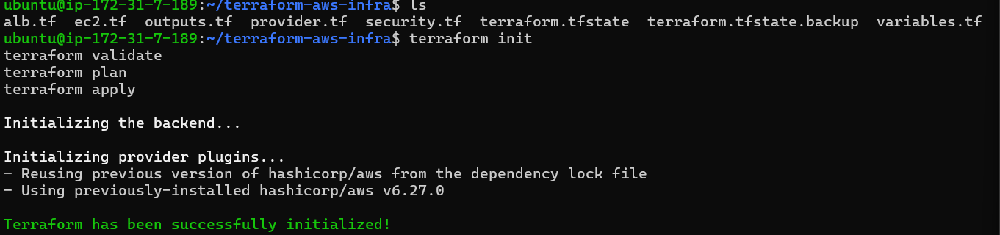
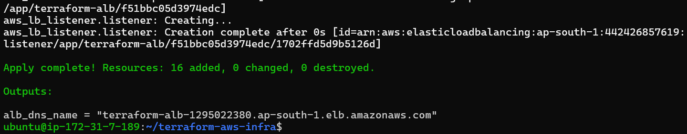
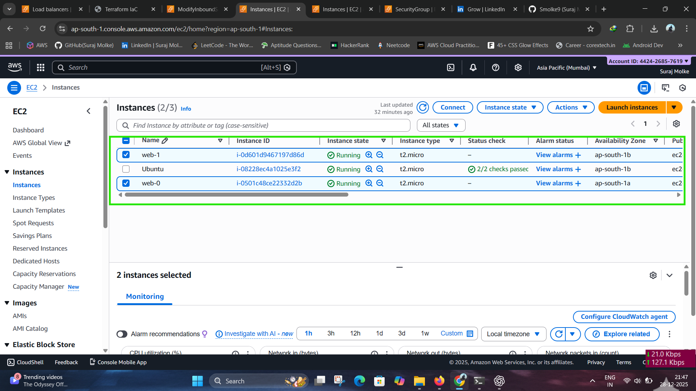
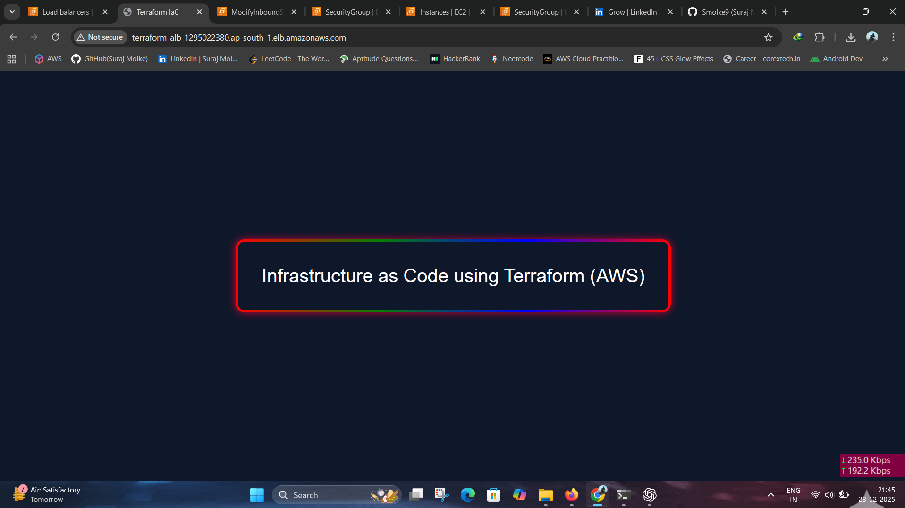

# Infrastructure as Code using Terraform (AWS)

## 🧱 Final Architecture
```
Internet
   |
Application Load Balancer (ALB)
   |
Target Group
   |
EC2 Instances
   |
Custom VPC
 ├── Public Subnets (2 AZs)
 ├── Internet Gateway
 └── Route Table
```

---

## 🛠️ Tech Stack
- Terraform  
- AWS EC2  
- VPC  
- Security Groups  
- Application Load Balancer (ALB)

---

## 📌 Prerequisites

### 1️⃣ AWS Account
Create an AWS account.

### 2️⃣ IAM User
Create IAM user with **Programmatic Access** and attach policies:
- AmazonEC2FullAccess
- AmazonVPCFullAccess
- ElasticLoadBalancingFullAccess

### 3️⃣ Install Tools (Ubuntu)

```bash
sudo apt update
sudo apt install -y unzip curl
```

#### Install Terraform
```bash
curl -fsSL https://releases.hashicorp.com/terraform/1.6.6/terraform_1.6.6_linux_amd64.zip -o terraform.zip
unzip terraform.zip
sudo mv terraform /usr/local/bin/
terraform -version
```

#### Install AWS CLI
```bash
sudo apt install awscli -y
aws --version
```

#### Configure AWS
```bash
aws configure
```
Enter:
- Access Key
- Secret Key
- Region: ap-south-1
- Output: json

---

## 📁 Project Structure
```
terraform-aws-infra/
├── provider.tf
├── variables.tf
├── vpc.tf
├── security.tf
├── ec2.tf
├── alb.tf
├── outputs.tf
├── terraform.tfvars
└── README.md
```

---

## 🚀 Deployment Steps

```bash
terraform init
terraform validate
terraform plan
terraform apply
```
Type **yes** when prompted.

---
## terraform files and terraform init


## terraform apply


## Terraform Output Create Instances

## 🌐 Access Application

```bash
terraform output
```
Open browser:
```
http://<ALB_DNS_NAME>
```

---

## 🧹 Destroy Infrastructure

```bash
terraform destroy
```

---

## ✅ Notes
- Uses public subnets across 2 AZs
- EC2 auto-registered with ALB target group
- Designed for DevOps & Terraform practice
